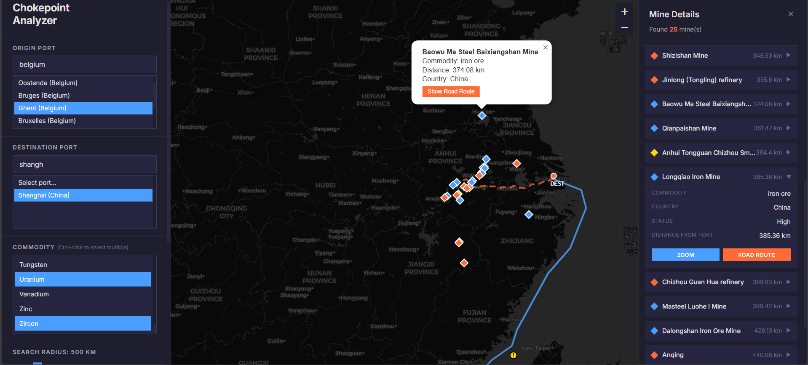

# Mine-Port-Agent-POC

**Global Supply Chain Chokepoint Analyzer** — An interactive web application that maps global ports, mines, and maritime chokepoints, then analyzes sea routes and road connections to identify critical vulnerabilities in the global supply chain.

---

## 📋 Project Origins

This project was developed through an iterative agent-assisted workflow:

1. **`project.txt`** — The initial outline containing the raw requirements and objectives for the project. It defined the goal of mapping ports, mines, and chokepoints along with technical stack preferences and UI design specifications.

2. **`project-skills.md`** — A detailed project specification document that was **generated by the [Cline](https://github.com/cline/cline) AI coding agent** based on the initial `project.txt`. Cline expanded the raw requirements into a comprehensive technical blueprint covering data schemas, backend architecture, frontend layout, API endpoints, styling guidelines, user flow, edge cases, and file structure. This served as the single source of truth for implementation.

3. **Implementation** — Using `project-skills.md` as the guide, Cline then built the entire application: the FastAPI backend (`backend.py`), the interactive frontend (`templates/index.html`, `static/js/app.js`, `static/css/styles.css`), and all supporting files.

---

## ✨ Features



- **Port-to-Port Sea Routes** — Select origin and destination ports from a global dataset and visualize the maritime route between them using the `searoute` library.
- **Chokepoint Detection** — Automatically identifies strategic maritime chokepoints (e.g., straits, canals) within proximity of the calculated sea route.
- **Mine Search** — Search for mines near the destination port by commodity type (copper, iron ore, coal, lithium, etc.) within a user-configurable radius.
- **Road Route Visualization** — View driving routes from the destination port to selected mines using the OSRM public API (with straight-line fallback).
- **Interactive Map** — Leaflet.js-powered map with all routes, ports, mines, and chokepoints rendered with distinct markers and color-coded layers.
- **Dark Minimal UI** — Sharp, no-rounded-corners dark theme with a two-sidebar layout for an optimal data exploration experience.

---

## 🧱 Architecture

```
project-root/
├── backend.py                  # FastAPI backend — all API endpoints & data logic
├── requirements.txt            # Python dependencies
├── templates/
│   └── index.html              # Single-page application frontend
├── static/
│   ├── css/
│   │   └── styles.css          # Dark theme, sharp design CSS
│   └── js/
│       └── app.js              # Frontend logic — map, API calls, UI interactions
├── data/
│   ├── global-mining-dataset.xlsx   # Mine data
│   ├── PortWatch_chokepoints_database.csv  # Maritime chokepoints
│   └── UpdatedPub150.csv             # World port index
├── project.txt                 # Original requirements outline
└── project-skills.md           # AI-generated project specification
```

### Backend (Python / FastAPI)

| Endpoint | Description |
|----------|-------------|
| `GET /api/ports` | Returns all ports for dropdown selection |
| `GET /api/commodities` | Returns distinct list of commodities |
| `GET /api/mines?commodity={c}&lat={lat}&lon={lon}&radius={km}` | Mines matching commodity within radius |
| `GET /api/route?origin_port_id={}&dest_port_id={}` | Sea route GeoJSON between two ports |
| `GET /api/road-route?port_lat={}&port_lon={}&mine_lat={}&mine_lon={}` | Road route from port to mine |
| `GET /api/chokepoints?route_geojson={}&proximity_km={}` | Chokepoints near the sea route |

### Frontend (HTML + JS + CSS)

- **Left Sidebar** — Port selection dropdowns, commodity picker, radius slider, action button
- **Map Panel** — Leaflet.js interactive map with dark tile layer
- **Right Sidebar (collapsible)** — Mine details and chokepoint details on click

---

## 🚀 Getting Started

### Prerequisites

- Python 3.9+
- pip

### Installation

1. **Navigate to the project directory:**
   ```bash
   cd Mine-Port-Agent-POC
   ```

2. **Create and activate a virtual environment:**
   ```bash
   python -m venv venv
   venv\Scripts\activate   # Windows
   source venv/bin/activate  # macOS/Linux
   ```

3. **Install dependencies:**
   ```bash
   pip install -r requirements.txt
   ```

4. **Ensure data files are in place** — Place the following datasets in the `data/` directory:
   - `global-mining-dataset.xlsx`
   - `PortWatch_chokepoints_database.csv`
   - `UpdatedPub150.csv`

5. **Run the backend server:**
   ```bash
   uvicorn backend:app --reload --host 0.0.0.0 --port 8000
   ```

6. **Open the app** — Navigate to [http://localhost:8000](http://localhost:8000) in your browser.

---

## 🛠 Tech Stack

| Technology | Purpose |
|------------|---------|
| **FastAPI** | REST API framework |
| **Uvicorn** | ASGI server |
| **Pandas** | Data loading & filtering |
| **Searoute** | Maritime route calculation |
| **Shapely / Geopy** | Geo-distance calculations |
| **OpenPyXL** | Excel file parsing |
| **Leaflet.js** | Interactive map rendering |
| **OSRM API** | Road routing (via HTTP) |

---

## 🔄 Workflow

1. **Select Ports** — Choose origin & destination ports from dropdowns
2. **View Sea Route** — Maritime route and chokepoints render on the map
3. **Search Mines** — Pick a commodity, set a radius, and find mines near the destination port
4. **Explore Details** — Click mine or chokepoint markers for detailed information
5. **View Road Routes** — Click "Show Road Route" to see driving paths from port to mine

---

## ⚙️ Configuration

- **Chokepoint proximity threshold** — Default 50 km (configurable via `proximity_km` parameter)
- **Mine search radius** — User-configurable via slider (10–500 km)
- **Port data** — Loaded from `UpdatedPub150.csv` (World Port Index)
- **Route caching** — In-memory LRU cache for sea route calculations

---

## 🤖 About Cline

This project was built with [Cline](https://github.com/cline/cline), an AI coding agent that operates directly in your IDE. Cline can read files, write code, execute commands, and iteratively build full-stack applications based on natural language requirements. The `project-skills.md` document was generated by Cline to flesh out the raw `project.txt` outline into a detailed specification before implementation began.